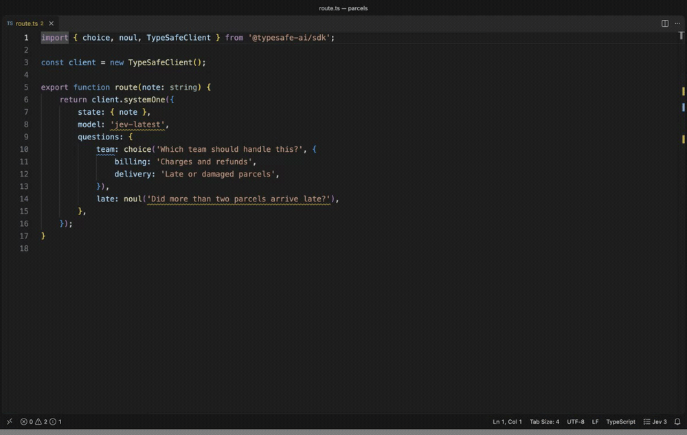
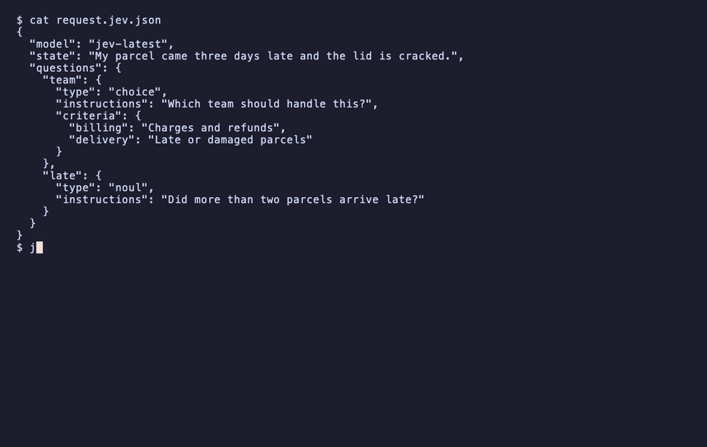

# JevLint-LE

Lint the questions you send to TypeSafe's Jev model, and to OpenAI's Decisions
API. JevLint-LE reads them out of your JSON and your code, and reports the ones
written in a way that is measured to produce bad answers. Linting makes no API
calls and needs no key. One optional command asks the model itself, Jev or
Luna, to check a file, using your own key.

Part of the LE family.



## Install

- **VS Code:** search for JevLint-LE in the Extensions view, or run
  `ext install nolindnaidoo.jevlint-le`.
- **Cursor, VSCodium and other editors that use Open VSX:** the same name,
  `nolindnaidoo.jevlint-le`.
- **Command line and MCP server:** `npx jevlint-le`. Nothing to install first.

## At a glance

- **Lints as you type** in JSON, JavaScript, TypeScript, Python, Rust and Go.
- **Fixes on the lightbulb** for the mechanical mistakes, and a way to silence
  a finding you disagree with.
- **The same rules in CI**, from a command line, and for AI agents, from an
  MCP server. One settings file covers all three.
- **Two vendors, one set of rules.** TypeSafe's `/v1/systemone` shape and
  OpenAI's `/v1/decisions` shape, `predicate`, `choices` and `levels`, are
  read into the same rules, and the AI SDK's `decide()` call for either.
- **Two optional commands that use your own key**: one asks the model, Jev or
  Luna, whether your questions have problems a text pattern cannot see, and
  one re-sends a question with its layout changed to see whether the answer
  holds.

A request like this one looks fine and has three problems:

```json
{
  "model": "jev-latest",
  "state": "My parcel came three days late and the lid is cracked.",
  "questions": {
    "team": {
      "type": "choice",
      "instructions": "Which team should handle this?",
      "criteria": { "billing": "Charges and refunds", "delivery": "Late or damaged parcels" }
    },
    "late": { "type": "noul", "instructions": "Did more than two parcels arrive late?" }
  }
}
```

| Finding | Why it matters |
|---|---|
| `JEV001` on `jev-latest` | The alias moves with each release, so answers can change with no change on your side |
| `JEV004` on `team` | A message about neither team is still forced into one of them |
| `JEV102` on `late` | Jev does not count reliably. Ask about each parcel and count in code |

## What it catches

Jev and Luna guarantee the type of the answer, not the answer. A badly formed
question still comes back with a confident-looking number. These rules catch
the mistakes that can be read from the text.

| Code | Name | Default | What it means |
|---|---|---|---|
| JEV000 | unreadable | hint | Part of the question is built at runtime, so the rules that need it did not run |
| JEV001 | unpinned-model | warning | `jev-latest` and `jev-preview` move with each release, so answers can change with no change on your side |
| JEV002 | choice-option-limit | error | A Choice has more than 255 options. The API rejects it |
| JEV003 | score-level-limit | error | A Score has more than 10 levels. The API rejects it |
| JEV004 | no-fallback-option | info | A Choice has no `other` or `none of the above`, so an input that fits no option is forced into one. The largest cost measured anywhere, and the hardest to tell from text |
| JEV005 | duplicate | error | A question id, option or level appears twice. In an object the later one silently replaces the earlier |
| JEV006 | criteria-shape | error | A Choice needs a map of options, a Score needs an array of levels, and a Noul takes `true` and `false` |
| JEV007 | invalid-question | error | The type is missing or unknown, or the instructions are an empty string |
| JEV008 | numeric-levels | warning | Score levels are bare numbers. Jev matches the state against each description and never sees its position |
| JEV009 | too-few-options | info | A Choice with one option or a Score with one level gives every input the same answer |
| JEV010 | unused-disable | warning | A `jevlint-le-disable` comment silences nothing, so it can only hide a finding added later |
| JEV011 | description-repeats-name | info | An option's description only repeats its name, or a Noul's criteria say yes and no. Jev matches the state against the description, and this one says nothing |
| JEV012 | terse-instructions | info | The instructions are one or two words, so the question leans on its id. Jev is sent the instructions and never the id |
| JEV101 | double-negative | info | A question negates twice in one clause, or a negation sits directly on another |
| JEV102 | arithmetic | warning | The question asks Jev to count or compare numbers |
| JEV103 | date-comparison | info | The question asks Jev to order two times or measure the gap between them |
| JEV104 | compound | off | A Noul joins two judgments with 'and' |
| JEV105 | generation | warning | The question asks for a value or for text to be written |
| JEV107 | negated-noul | off | A Noul with no criteria is phrased so that yes means something is absent |
| JEV108 | inverted-criteria | off | A Noul's 'true' criterion describes the negative case |
| JEV110 | degree-levels | warning | Score levels are degree words, bare labels, or one word turned up and down. Nothing for Jev to match the state against |
| JEV111 | numeric-encoding | off | The question refers to a value by hex or RGB encoding |
| JEV112 | undefined-boundary | info | A Noul with no criteria turns on a word such as large, often or enough |
| JEV301 | jev-counting | warning | Jev reads the question as needing counting or arithmetic |
| JEV302 | jev-undefined-boundary | info | Jev reads a Noul as turning on a matter of degree with no stated line |
| JEV303 | jev-overlapping-options | info | Jev reads two options of a Choice as covering the same cases |
| JEV304 | jev-overlapping-levels | warning | Jev reads two levels of a Score as the same situation |
| JEV305 | jev-label-mismatch | warning | Jev reads an option as named for one thing and described as another |
| JEV306 | jev-criteria-off-topic | info | Jev reads the criteria as deciding something the instructions do not ask |
| JEV307 | jev-ordered-options | info | Jev reads a Choice's options as steps on one scale, which a Score would place between |
| JEV308 | jev-unordered-levels | info | Jev reads a Score's levels as unordered categories, which a Choice would pick from |
| JEV309 | jev-depends-on-sibling | info | Jev reads a question as needing another question's answer from the same request |
| JEV310 | jev-overlapping-questions | info | Jev reads two questions in one request as asking for the same judgment |
| JEV311 | jev-answer-not-in-state | info | Jev reads the state written in the file as not holding what the question asks about |
| JEV312 | jev-orders-in-state | info | Jev reads part of the state written in the file as giving orders to its reader |

Each finding links to [its own page](https://github.com/nolindnaidoo/jevlint-le/blob/main/docs/rules/README.md), with an example that is flagged, one that is not, how to fix it and how to silence it. Each page links on to the TypeSafe documentation the rule comes from.

## Where it looks

- JSON and JSONC request bodies, in TypeSafe's shape or OpenAI's.
- Object literals in JavaScript and TypeScript, including requests passed
  inline to `client.systemOne(...)` and `client.decisions.create(...)`, and
  the Vercel AI SDK's `decide({ questions })` for either vendor.
- `noul()`, `choice()` and `score()` calls in files that use
  `@typesafe-ai/sdk`.
- Python: dicts, `Noul(...)`, `Choice(...)` and `Score(...)` from
  `typesafe_sdk` or a library that wraps it, and requests passed to
  `system_one(...)` or `client.decisions.create(...)`.
- Rust: the JSON inside `json!`, structs and enum variants named for a
  question type, and `::noul(...)` style constructors.
- Go: maps with string keys, structs with a `Type` field, and structs named
  for a question type.
- A request pasted as JSON into a string, in any of these languages.
- Any other language: have your program write the request it sends to a
  `.jev.json` file and open that. Every check runs on it, and nothing in it
  is built at runtime, so nothing is skipped.
- `jev/ask` rules in an `oxlint-plugin-jev` config.

## OpenAI's Decisions API

OpenAI's Decisions API, model `gpt-6-luna`, asks the same kind of question
as Jev in a different shape. JevLint-LE reads it from 0.5.0. What that
covers, exactly:

- **Read.** A `/v1/decisions` request body, `client.decisions.create(...)`
  in TypeScript and Python, and the Vercel AI SDK's `decide()`. A
  `predicate` is read as a Noul, `choices: [{ value, description }]` as a
  Choice's options and `levels: [{ label, description }]` as a Score's
  levels, into the same rules.
- **Checked.** Every rule with evidence behind it: the missing fallback
  option, a description that only repeats its name, terse instructions,
  degree levels, duplicates, counting, an undefined boundary and the rest.
  Findings name Luna. OpenAI's own guide asks for the same things.
- **Held back.** `JEV002` and `JEV003` are about TypeSafe's request limits,
  and OpenAI publishes none. `JEV001` is about Jev's moving aliases, and
  OpenAI has one model id.
- **Shape mistakes** are reported in OpenAI's own field names: `choices`
  written as a map or as bare names, a Choice with no `choices`, a Score
  with no `levels`. A mistyped `predicate` is fixed on the lightbulb. The
  reshape fix is Jev-only.
- **Asking Luna.** Set `jevlint-le.jev.model` to `gpt-6-luna`, or pass
  `--jev-model gpt-6-luna`, with an OpenAI key. The next section says how.
- **Measured on Jev, not yet on Luna.** Every default in these rules was
  set by measuring what the defect costs `jev-1.13.0`. Luna has not been
  measured, so on a Luna question they are the same rules with Jev's
  defaults, and every finding from asking Luna says its cutoff was set on
  Jev. The request sent to Luna follows OpenAI's API reference and has not
  yet been run against the live API. Both wait on a key.

## Check a file with Jev

Rules `JEV301` to `JEV312` are not part of linting. They run only when you run
**JevLint-LE: Check This File with Jev**, or pass `--jev` on the command
line. Either sends each question in the file to a model and asks it about
problems a text pattern cannot see: options that overlap, an option whose
name contradicts its description, criteria about the wrong thing, a Choice
that should be a Score, two questions that ask the same thing, a question
that needs another question's answer.

1. Give it your key, in either of two ways. Run **JevLint-LE: Set TypeSafe
   API Key** and paste it, which stores it in your operating system keychain.
   Or type it into **Settings** under `jevlint-le.jev.apiKey`, which can only
   be set in your user settings and is left out of Settings Sync.
2. Open a file with questions and run **JevLint-LE: Check This File with
   Jev**.

**To ask Luna instead**, set `jevlint-le.jev.model` to `gpt-6-luna` and give
it an OpenAI key the same two ways: **JevLint-LE: Set OpenAI API Key**, or
`jevlint-le.jev.openaiApiKey`. The same checks go to OpenAI's Decisions API
as predicates. One thing to know: the cutoffs that decide when a check fires
were set on `jev-1.13.0`, and every finding from Luna says so until Luna is
measured the same way. The probe asks Jev only.

What to know before you run it:

- **It uses your key and your credits.** One request per question and one more
  per request body, about 800 input tokens each. At TypeSafe's published price
  that is roughly three thousandths of a cent per question, and at OpenAI's
  about a hundredth of a cent.
- **Only questions are sent**: type, instructions, criteria and ids. Your
  `state` is not, unless you turn on `jevlint-le.jev.sendState`. With that on,
  a state written out in the file is sent too, and two more checks run: does
  the state hold what each question asks about, and does it carry text that
  gives orders to its reader.
- **A question with a part built at runtime is not sent.** The summary says
  how many were held back.
- **A run sends at most `jevlint-le.jev.maxCalls` requests**, 25 by default.
- **It is disabled in an untrusted workspace.** Run **Workspaces: Manage
  Workspace Trust** and trust the folder to turn it on.
- **Findings disappear when you edit the file**, because they were about the
  old text. Editing or closing the file during a check stops the check.
- **Each finding shows the probability Jev gave it.** Treat it as an argument
  with a number attached, not a verdict.

Turn on `jevlint-le.jev.confirm` and it first tells you how many requests it
will make, roughly how many tokens and what that costs, and waits for a yes.
It is off by default: running the command is the decision to send.

## Project settings

Put a `jevlint-le.json` in your project and the editor and the command line
both read it, so what you see while writing is what CI reports.

```json
{
  "rules": { "JEV004": "error", "JEV112": "off" },
  "fallbackOptions": ["other", "none", "unsure"],
  "ignore": ["JEV004:department"],
  "exclude": ["fixtures", "**/*.generated.ts"]
}
```

`exclude` lists files and folders not to lint, relative to the settings file.
`**` crosses folders, `*` stays inside one, and a name with no slash matches
at any depth. The editor and the command line leave out the same files.

The nearest file wins, looking from the linted file upward, so a folder can
have its own. Where one applies, it replaces the `rules`, `fallbackOptions`
and `ignore` settings in the editor. If it cannot be read, nothing is linted
and the status bar says why. A key it does not know is an error, so a typo
cannot quietly leave a rule on.

To silence one finding, use the lightbulb: **Disable JEV004 for this line**
or **for this file** writes the comment for you. Strict JSON has no comments,
so there a finding is silenced with `ignore`.

## Command line

The same linting runs outside the editor, for CI and for any editor that is
not VS Code.

### One version for the editor and CI

Install it in the project, as you would any linter:

```bash
npm install --save-dev jevlint-le
```

The editor then lints with that copy, not the one the extension carries, so
what you see while typing is what `npx jevlint-le` reports in CI. The version
changes when `package.json` does, and for everyone at once. The status bar
shows `project 0.5.2` while a project's copy is in use.

With nothing installed the extension lints with its own copy, with no setup.

It also uses its own copy, and the status bar says `project has 0.2.0` with
the reason in its tooltip, when the project's copy cannot be used:

- the workspace is not trusted, because loading the copy runs code from it
- the copy is older than 0.3.0, the first version an editor can load
- the copy fails to load, or does not read that kind of file

**Check This File with Jev** and the probe always run the extension's own
code, whatever the project installs.



```bash
npx jevlint-le src/                 # a directory, searched for files it reads
npx jevlint-le request.jev.json     # one file
npx jevlint-le --format github .    # annotations on a pull request
```

It exits 0 when the run passes, 1 when a finding fails it, and 2 when it
could not do what was asked: an unknown option, a missing path, or nothing to
read. Errors always fail a run. Warnings fail it only past `--max-warnings`.

| Option | What it does |
|---|---|
| `--format <stylish\|compact\|json\|github\|sarif\|junit>` | How findings are printed. `stylish` groups them by file and is the default. `compact` is one per line as `path:line:column`. `sarif` is for code scanning and `junit` for test reporters. Also `-f` |
| `--rule <CODE=level>` | Set one rule to `off`, `hint`, `info`, `warning` or `error`. A rule's name works in place of its code, and `warn` means `warning` |
| `--config <file>` | Use this settings file, and no `jevlint-le.json` found near the files. Also `-c` |
| `--max-warnings <n>` | Fail when more than `n` warnings are reported |
| `--stdin-filename <path>` | Lint standard input as if it were that file |
| `--fix` | Write the fixes that only mend what the API would refuse |
| `--quiet` | Print errors only |
| `--jev` | Also ask the model about each question. Sends them to TypeSafe with `TYPESAFE_API_KEY`, or with `--jev-model gpt-6-luna` to OpenAI with `OPENAI_API_KEY` |
| `--jev-plan` | Say what `--jev` would send, and send nothing |
| `--jev-model <id>` | The model `--jev` asks: a Jev version, or `gpt-6-luna` for OpenAI's Decisions API. Default `jev-1.13.0` |
| `--jev-max-calls <n>` | The most requests `--jev` may send in the run. Default 25 |
| `--jev-send-state` | With `--jev`, also send state written out in a file |
| `--color`, `--no-color` | Colour the default format, or do not. Without either it is coloured in a terminal, unless `NO_COLOR` is set |
| `--no-error-on-unmatched-pattern` | Pass when the paths hold no file to lint |
| `--mcp` | Run as an MCP server |

The summary line always says how many questions could not be read in full
and names any file skipped for its size and any folder or file it could not
read. It does not follow linked folders. It does not run the checks that ask
Jev, and it never uses the network, unless you pass `--jev`.

### In CI and before a commit

On GitHub, the action annotates a pull request:

```yaml
- uses: nolindnaidoo/jevlint-le@v0.5.2
  with:
    paths: src
```

For GitHub code scanning, write SARIF and upload it:

```yaml
- run: npx jevlint-le --format sarif src > jevlint.sarif
  continue-on-error: true
- uses: github/codeql-action/upload-sarif@v3
  with:
    sarif_file: jevlint.sarif
```

`--format junit` writes the XML that Jenkins, GitLab and most test reporters
read. Only an error is a failed case there, since only an error fails a run.

With [pre-commit](https://pre-commit.com):

```yaml
- repo: https://github.com/nolindnaidoo/jevlint-le
  rev: v0.5.2
  hooks:
    - id: jevlint-le
```

### Checking with Jev

`--jev` runs the checks that ask Jev itself, `JEV301` to `JEV312`, after the
linting. It is the only option that uses the network, and nothing in a
settings file can turn it on.

```bash
npx jevlint-le --jev-plan src/                    # what it would send. No key, nothing sent
TYPESAFE_API_KEY=... npx jevlint-le --jev src/    # send it
```

- The key is read from `TYPESAFE_API_KEY` and from nowhere else. It is never
  printed.
- A question with a part built at runtime is never sent. The summary counts
  the ones held back.
- State is not sent unless you add `--jev-send-state`.
- `--jev-max-calls` is a limit for the whole run. A run that needs more exits
  2, so a job cannot pass after checking part of a project.
- A rejected key, a failed request or a run you stop also exits 2, and says
  how many requests were answered of how many were planned.
- These findings are warnings or less by default, so they fail a run only
  when `--rule` raises one or `--max-warnings` is passed.

## For AI agents

The same program is an MCP server, so an agent that writes Jev or OpenAI
Decisions questions can lint what it wrote and fix it before you see it. The
tool descriptions and the server's instructions name both vendors and all
three request shapes, so an agent knows to call it for any of them.

Agents running inside VS Code get it with no setup: the extension offers the
server to the editor, which starts it when an agent calls a tool. For any
other client, point it at the program:

```json
{
  "mcpServers": {
    "jevlint-le": { "command": "npx", "args": ["-y", "jevlint-le", "--mcp"] }
  }
}
```

It offers three tools: `lint_text` for a request or source code passed as
text, `lint_paths` for files on disk, and `list_rules`. It never uses the
network, and it does not run the checks that ask Jev.

## Probe a question

Put the cursor in a question and run **JevLint-LE: Probe the Jev Question at
the Cursor**. It sends that question against the state written beside it,
three times as written and then with the layout changed: options reversed,
option names hidden, levels reversed, criteria removed. A report opens showing
whether the answer moved.

If the answer changes when only the order of the options changes, the
question is not deciding it. If three identical requests disagree, the input
is too close to call.

It needs the state written out in the file, it sends that state, and it costs
five or six requests.

Nothing else in this extension uses the network. On the command line, only
`--jev` does.

## What it will not tell you

- **Whether a well-formed question is right on your data.** That needs labeled
  examples and calls to Jev.
- **Anything about a value it cannot see.** A question built from variables is
  reported as unreadable and counted in the status bar. A file is never shown
  as clean while part of it went unread.
- **Everything about wording.** `JEV101` to `JEV112` are heuristics over
  English text. A rule is on only where a badly written question cost answers
  or confidence against Jev, in our runs or in someone else's, and it stays
  on only while it is right on at least 9 of 10 of its findings on public
  code it was not tuned against. Four that describe failure modes in
  TypeSafe's docs, `JEV104`, `JEV107`, `JEV108` and `JEV111`, did not fail on
  `jev-1.13.0` and are off. Switch any of them on in `jevlint-le.rules`. Two
  more were removed in 0.4.0 for being wrong every time they fired.
- **Anything about a question that is not in English.**
- **What a lone object lacks.** A `{ type, instructions }` outside a
  `questions` map may be a template or half of a builder, so a missing
  `criteria` is only reported inside a request.

`JEV004` is informational because the advice behind it is conditional: add a
fallback when the options might not cover every input. It fires on 9 of the 11
Choice examples in TypeSafe's own docs. If your options are exhaustive, turn it
off for that question.

## Suppressing a finding

In code:

```ts
// jevlint-le-disable-next-line JEV004
const side = { type: 'choice', instructions: 'Heads or tails?', criteria: { heads: null, tails: null } };
```

`jevlint-le-disable-line` covers the same line and `jevlint-le-disable` the whole file.
Leave the code off to silence every rule.

A comment that silences nothing is reported as `JEV010`, so one left behind
after its finding was fixed cannot hide a new finding later.

## Fixing

Some findings can be mended without a decision from you: a Noul criteria key
written `yes` where the API takes `true`, a mistyped question type, criteria
in the wrong shape. `npx jevlint-le --fix` writes those, and the summary of
any run says how many it would mend.

In the editor, fix on save does the same:

```json
{ "editor.codeActionsOnSave": { "source.fixAll.jevlint-le": "explicit" } }
```

Adding a fallback option and pinning a model change what a working request
does, so they are never written for you. They stay on the lightbulb.

JSON has no comments, so use the setting:

```json
{ "jevlint-le.ignore": ["JEV004:side"] }
```

## Keyboard shortcuts

Every command can be given a shortcut. Open **Keyboard Shortcuts**, search for
`JevLint-LE`, and press the keys you want on any command in the list. None is
bound out of the box, so nothing here can collide with a shortcut you already
use.

Or write them into `keybindings.json`. The keys here are only an example:

```json
[
  { "key": "ctrl+alt+j", "command": "jevlint-le.lintFile", "when": "editorTextFocus" },
  { "key": "ctrl+alt+k", "command": "jevlint-le.checkWithJev", "when": "editorTextFocus" }
]
```

| Command | Id |
|---|---|
| Lint Jev Questions in This File | `jevlint-le.lintFile` |
| Lint Jev Questions in the Workspace | `jevlint-le.lintWorkspace` |
| Check This File with Jev | `jevlint-le.checkWithJev` |
| Probe the Jev Question at the Cursor | `jevlint-le.probeQuestion` |
| Set TypeSafe API Key | `jevlint-le.setApiKey` |
| Set OpenAI API Key | `jevlint-le.setOpenAIApiKey` |
| Clear API Keys | `jevlint-le.clearApiKey` |
| Open Settings | `jevlint-le.openSettings` |

The two that say Jev send requests with your key, so pick keys for them you
will not press by accident.

## Settings

| Setting | Default | Meaning |
|---|---|---|
| `jevlint-le.rules` | `{}` | Severity per rule: `off`, `hint`, `info`, `warning`, `error` |
| `jevlint-le.fallbackOptions` | `other`, `none`, `unknown`, `unclear`, `uncertain`, `unsure`, `ambiguous`, `undetermined`, `neither`, `not stated`, `not applicable`, `insufficient evidence`, `cannot tell`, `n/a`, and "other" in five other languages | Words that make an option a fallback for `JEV004`. An option counts when one of them is a word in its name, so `none_implied` and `other_or_unclear` count |
| `jevlint-le.ignore` | `[]` | `CODE:questionId` entries to drop |
| `jevlint-le.include` | JSON, JS and TS files | Files the workspace command lints |
| `jevlint-le.exclude` | `node_modules` and build output | Files the workspace command skips |
| `jevlint-le.maxFileSizeBytes` | `1000000` | Larger files are reported as skipped |
| `jevlint-le.notificationsLevel` | `important` | How much is said in notifications. `all` adds a summary after each command, and `silent` shows a message only when a command could not run. Findings always show in the editor |
| `jevlint-le.jev.model` | `jev-1.13.0` | The model **Check This File with Jev** asks: a Jev version, or `gpt-6-luna` for OpenAI's Decisions API. Pinned to the version its checks were calibrated on |
| `jevlint-le.jev.maxCalls` | `25` | The most requests one check may send |
| `jevlint-le.jev.sendState` | `false` | Also send a state written in the file, so Jev can check it |
| `jevlint-le.jev.confirm` | `false` | Before a paid command sends anything, show what it will send and cost, and wait for a yes |
| `jevlint-le.jev.apiKey` | empty | Your TypeSafe key, if you would rather type it here than use the keychain. User settings only |
| `jevlint-le.jev.openaiApiKey` | empty | Your OpenAI key, the same way, used when the model is `gpt-6-luna` |

## Development

```bash
bun install
bun run typecheck && bun run lint && bun run test
bun run build
bun run test:integration   # real VS Code against samples/
bun run package            # release/jevlint-le-<version>.vsix
bun run test:e2e-vsix      # the packaged VSIX in a clean profile
```

`AGENTS.md` is the engineering standard. `SPEC.md` is what the product is and
what is planned. `samples/` is a workspace with planted mistakes, used by
`bun run test:integration`, which drives a real VS Code.

## License

MIT
